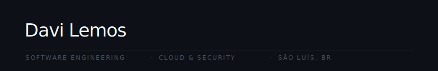

<p align="center">
  
</p>

---

Software Engineering student and IT Intern, currently building a strong foundation in Cloud, Cybersecurity, DevSecOps, Infrastructure and Data Engineering.

My focus is on understanding how modern IT environments are built, secured, automated and monitored — from data pipelines and dashboards to cloud environments, CI/CD workflows and security practices.

---

## Current Focus

```
Cloud & Infrastructure     Azure · cloud architecture · networking · IAM · governance
Cybersecurity & DevSecOps  secure configs · vulnerability management · logging · SIEM · CI/CD security
Azure DevOps & CI/CD       repositories · environments · deployment workflows · automation
Data & Analytics           Power BI · SQL · Excel · KPIs · operational reporting
Backend & Automation       Python · Django · C# · ASP.NET · SQL Server · PostgreSQL · APIs
```

---

## Experience

**Vale · IT Intern — internal process improvement, operational reporting and data integration**

Working with Power BI, Power Platform, SharePoint, Excel, SAP data, Azure DevOps and SQL-based data analysis.
Organizing, transforming and improving access to operational data — reducing manual work, improving visibility and supporting better decision-making.

Starting to explore opportunities to apply Cloud Security, DevSecOps and governance practices in real internal environments, especially around repositories, deployment flows, access control, documentation and automation.

---

## Portfolio Direction

Practical projects involving:

- CI/CD pipelines with security checks
- Azure DevOps repository and environment governance
- Infrastructure and cloud security documentation
- Data pipelines using SQL, Python and Power BI
- Monitoring, logging and vulnerability analysis labs
- Automation for internal workflows and operational reporting

---

## Contact

[linkedin.com/in/davilslv](https://linkedin.com/in/davilslv)
